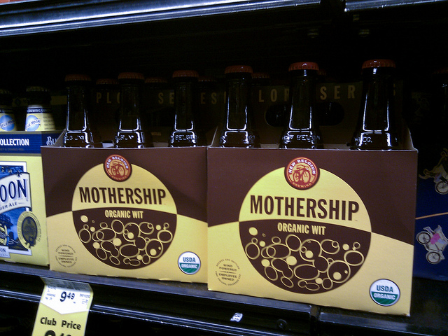
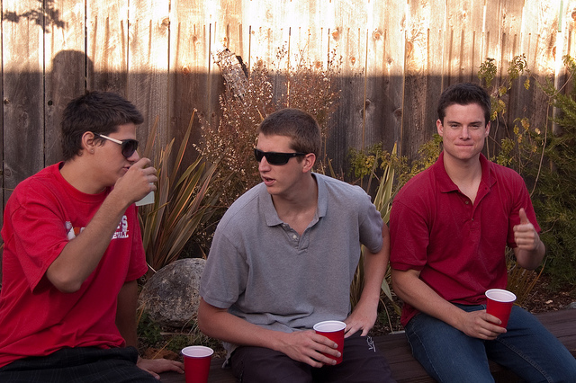
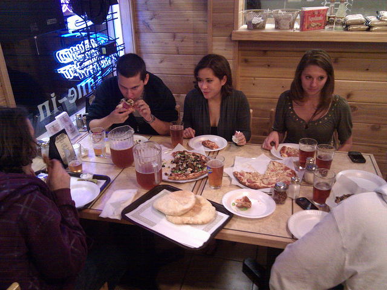
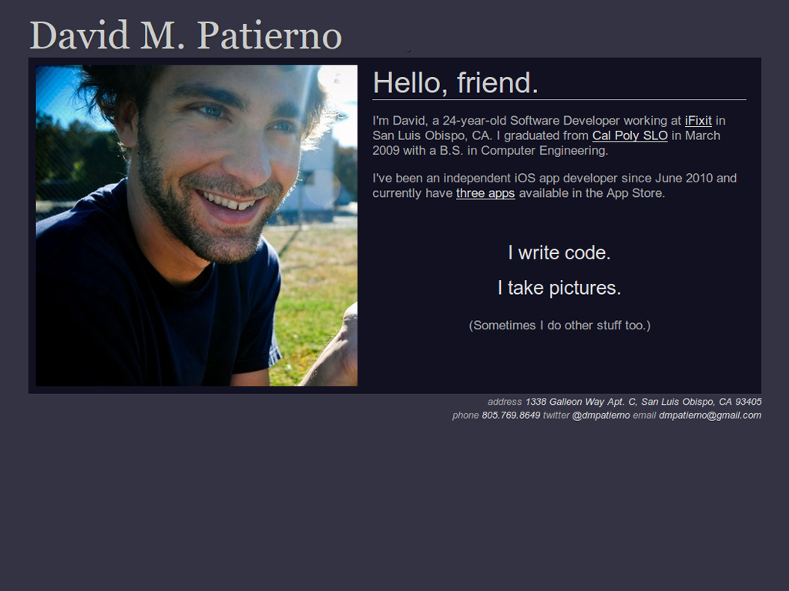
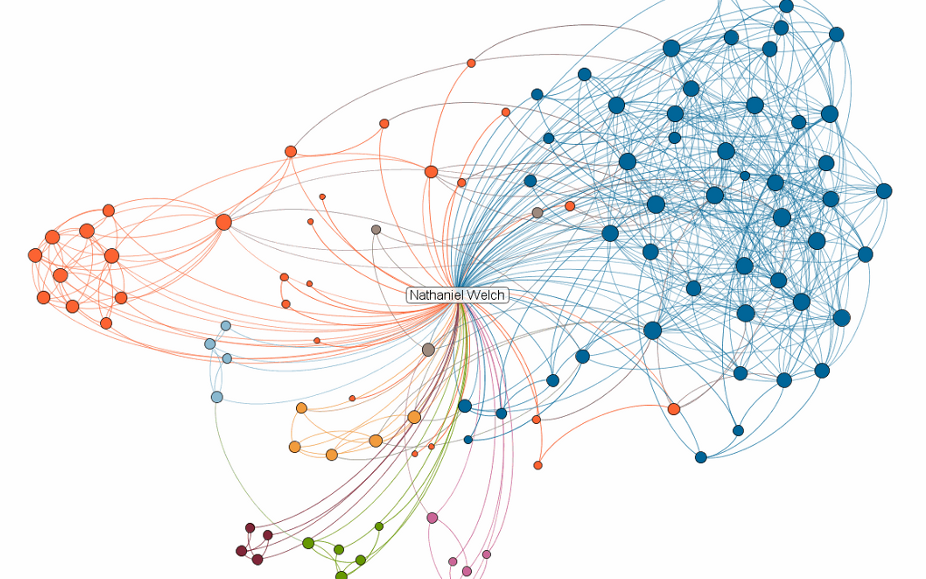

!SLIDE smbullets center 15seconds

### Please drink responsibly.

!SLIDE 15seconds center

!SLIDE 15seconds
# BUT WHY WAIT?!?!

## ACT NOW!

### (Contact them first)

!SLIDE 15seconds smbullets center

### Be courteous, offer something in return for their help

!SLIDE 15seconds center smaller
# But what are you going to talk about?

## How about them?

!SLIDE 15seconds

# OR HOW ABOUT YOU?
### Well talk about them first, then you!

!SLIDE 15seconds smbullets
## How can they know about you?

 * Get a website. <!-- <small>Simplest Way: [Github Pages][ghp] and a domain name.</small>-->
 * ex. <http://natwelch.com>

[ghp]: http://pages.github.com/

!SLIDE 15seconds bullets

 * Put your name on it, and five pieces of information about yourself.

!SLIDE 15seconds full-page

!SLIDE 15seconds

# SHARE YOUR WORK

### Warning: I am a socialist, elitist, Linux nerd

!SLIDE 15seconds bullets
# Excuses for not sharing:

 * It's too hard
 * My work sucks
 * No one cares

!SLIDE 15seconds bullets
# (partially) Lies!

 * takes 30 minutes
 * you will actually come back to it
 * 90% of the time, no one cares

!SLIDE 15seconds
## So you've got a website...

# What now?

## Link to your page from wherever you exist online. <small>(Facebook, LinkedIn, Twitter, email, whatever.)</small>

!SLIDE 15seconds center

# let's talk social graphs

!SLIDE 15seconds full-page

!SLIDE 15seconds
## Each one of those dots is someone you could be drinking with RIGHT NOW

!SLIDE 15seconds

## Maybe they have input on your book, startup, crazy idea, strange rash, etc.

!SLIDE 15seconds

# RECAP
### Lubricant.

!SLIDE 15seconds
# Ruby Web Dev Talk
## Build a website in an hour
### 2/8/11, 7pm 14-301

!SLIDE
# Thanks!
## The End.
### slides: [natwelch.com/talks/self-promotion/](http://natwelch.com/talks/self-promotion/)

### natwelch.com  /  @icco

