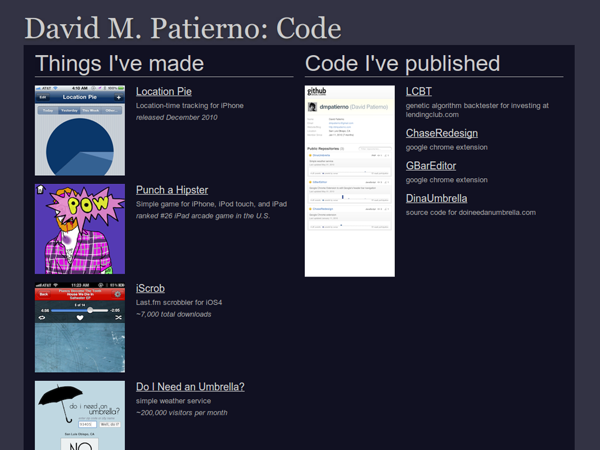
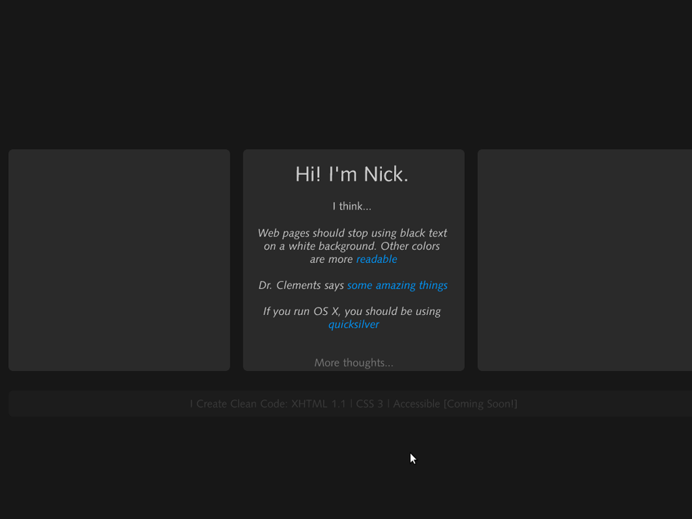
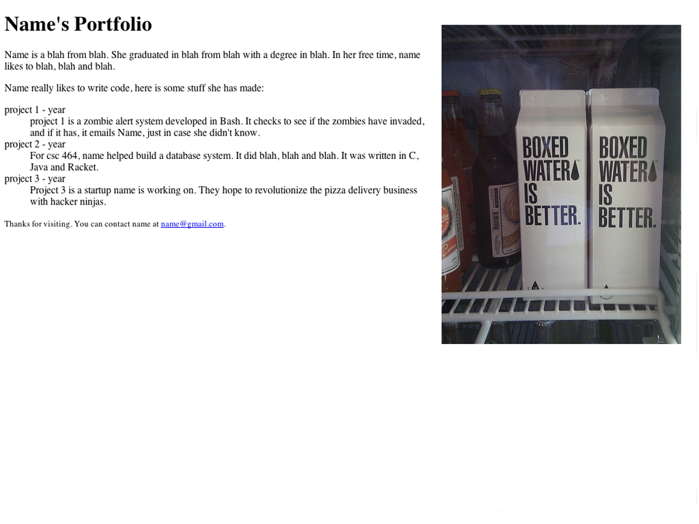

!SLIDE
# Personal Web Page Creation
## February 18th, 2011
## CSC 300

!SLIDE smbullets
# Nat Welch
### <nat@natwelch.com>

!SLIDE
# Examples:

!SLIDE full-page

!SLIDE full-page

!SLIDE full-page

!SLIDE full-page

!SLIDE full-page

!SLIDE full-page

!SLIDE full-page

!SLIDE full-page

!SLIDE full-page

!SLIDE
# The simplest page:
### <https://github.com/icco/personal-website-talk/blob/master/example.html>

!SLIDE full-page

!SLIDE
### Alright. Let's put our site online.
## Two Options:
### 1) Your CSC page or 2) GitHub pages

!SLIDE
# Your CSC page
### <https://wiki.csc.calpoly.edu/labs/wiki/LabFAQ#WebDirectorywww>
### http://users.csc.calpoly.edu/~username

!SLIDE command
# mkdir ~/www
# setfacl -m user:apache:--x,mask:--x ~
# setfacl -m user:apache:r-x,mask:r-x ~/www
# touch index.html && chmod 644 index.html

!SLIDE
# GitHub Pages

!SLIDE
#### 1. Create a GitHub Account
#### 1.5 follow the instructions to create an ssh key (<http://help.github.com/>)
#### 2. Create a public repository named `user.github.com`.

!SLIDE command
## 3. upload your site.
# mkdir user.github.com
# git init
# echo 'hello' > index.html && git add index.html
# git commit -m 'init.'
# git remote add origin git@github.com:user/user.github.com.git
# git push origin master

!SLIDE bullets
# Other sites

 * http://flavors.me
 * http://about.me
 * AWS EC2 Micro Instance

!SLIDE full-page

!SLIDE
# Closing Statements
## Represent yourself
## Feel free to ask for help
## Keep it up to date

!SLIDE
## The End.
# Questions?
### slides: [natwelch.com/talks/personal](http://natwelch.com/talks/personal)

