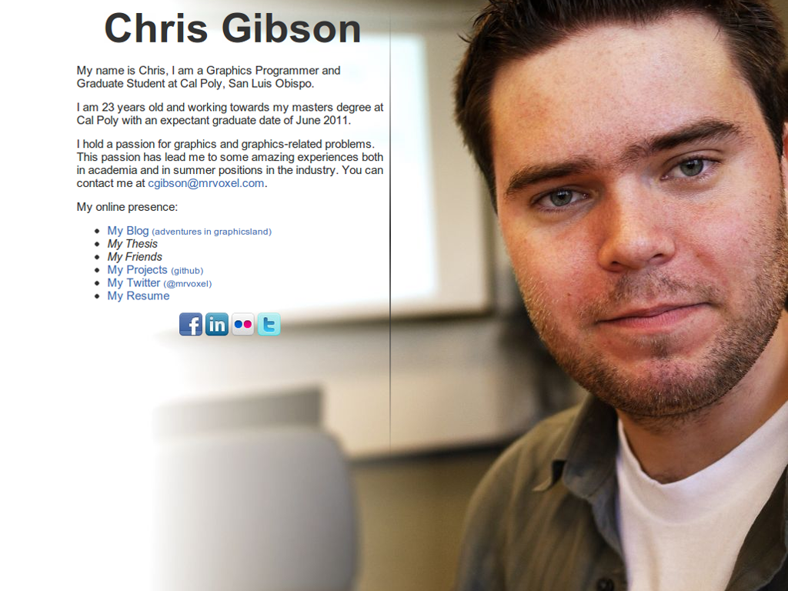
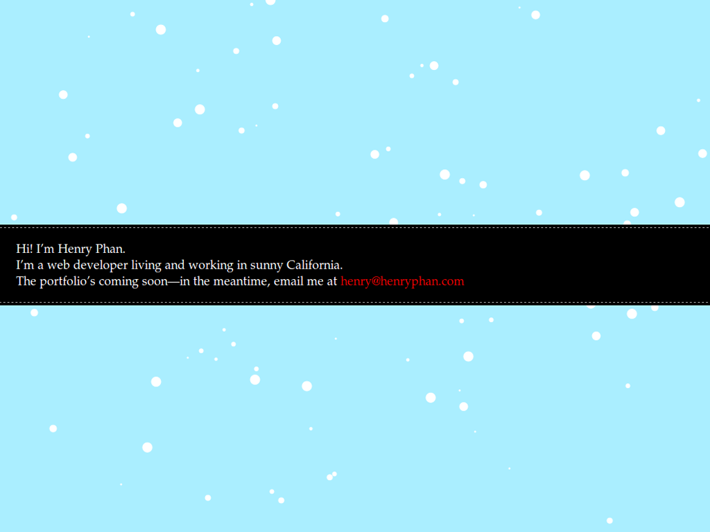
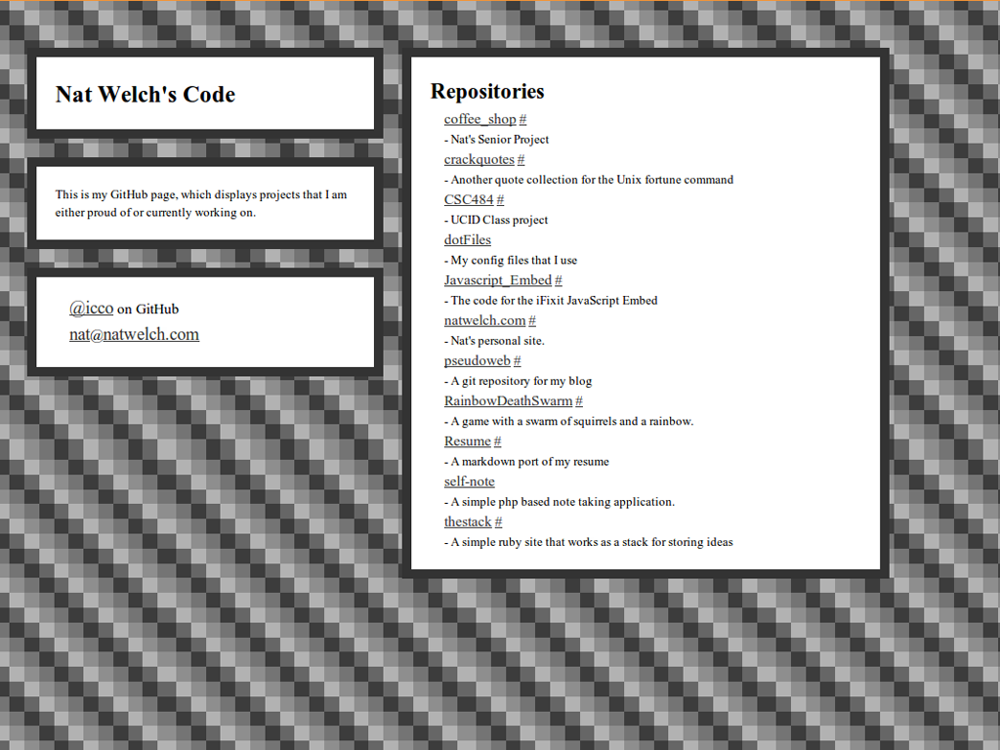

!SLIDE 
# Personal Web Page Creation
## February 18th, 2011
## CSC 300

!SLIDE smbullets
# Nat Welch 
### <nat@natwelch.com>

!Slide
Examples:

!SLIDE full-page

!SLIDE full-page

!SLIDE full-page

!SLIDE full-page

!SLIDE full-page

!SLIDE full-page

!SLIDE
# The simplest page:
### <>

!SLIDE full-page

!SLIDE
### Alright. Let's out our site online.
## Two Options:
### 1) Your CSC page or 2) GitHub pages

!SLIDE
# Thanks!
## The End.
### slides: [natwelch.com/talks/personal-website-talk](http://natwelch.com/talks/personal-website-talk)
